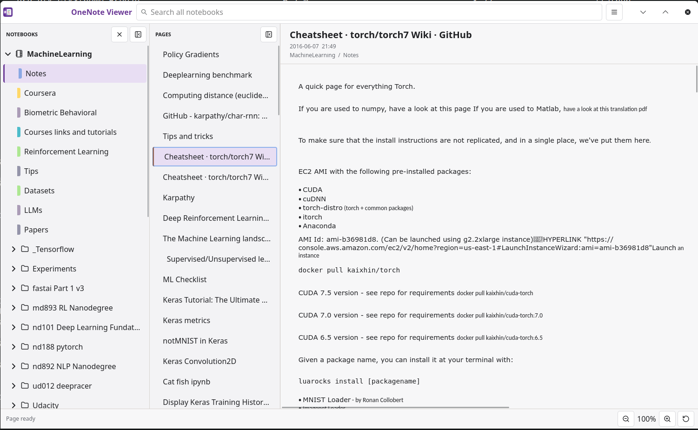
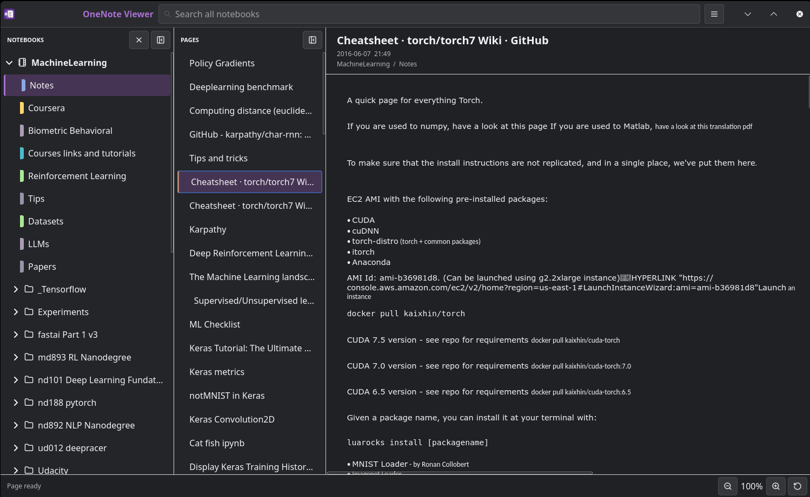

# OneNote Viewer for Linux

OneNote Viewer is a native Linux desktop application for
opening, viewing, indexing, and searching local Microsoft OneNote notebooks.
It reads the native `.one` and `.onetoc2` data directly and reconstructs the
OneNote freeform page canvas; HTML, Markdown, PDF, or another linear document
format is never its canonical representation. It is deliberately read-only:
source notebook files are never modified.

Multiple notebook directories remain open together in one workspace, with the
familiar notebook/section-group/section/page/canvas hierarchy and one search
scope across all of them. This is a desktop viewer, not a converter or an
import bridge to another notes application.

The viewer is also a reference consumer of reusable components. Native
OneNote parsing, page layout/scene construction, GTK rendering, and
index/query behavior live behind documented library boundaries so other
note-taking and knowledge-management software can render `.one` sections or
find relevant OneNote pages without adopting the complete desktop application.

This repository contains a working Rust/GTK implementation, its specifications
and architecture decisions, and a versioned copy of the primary format
references. The implementation is a functional pre-release baseline; it is not
yet a broad format-compatibility or visual-fidelity claim.

## Install

Flatpak is the primary release channel.

1. [Download OneNote Viewer 0.1.5](https://github.com/emsi/OneNoteViewer/releases/latest/download/OneNoteViewer-0.1.5-linux-x86_64.flatpak).
2. Open the downloaded file with your software center and install it.

Alternatively, install it from a terminal opened in the download folder:

```bash
flatpak install --user --or-update ./OneNoteViewer-0.1.5-linux-x86_64.flatpak
```

Start **OneNote Viewer** from the desktop application menu. Flatpak and the
Flathub repository must already be configured; the
[installation guide](docs/INSTALL.md) covers that setup, checksum verification,
updates, removal, and the AppImage alternative.

## Open Notebooks

Use the application menu to open a `.one`, `.onetoc2`, `.onepkg`, or notebook
directory. Additional notebook directories join the same searchable workspace
without being moved. Notebook folders copied under the configurable default
notebooks location open automatically on the next launch.

## Screenshots

### Light Theme



### Dark Theme



## Scope

The initial product:

- automatically opens notebook folders under the configurable
  `$XDG_DOCUMENTS_DIR/OneNoteViewer` default notebooks location;
- opens local notebook directories containing `.onetoc2` and `.one` files;
- opens standalone `.one` sections;
- accepts `.onepkg` export packages through a one-time, managed extraction to
  a normal directory tree of `.onetoc2` and `.one` files;
- reads both desktop revision-store files and locally downloaded FSSHTTP
  packaged files, without contacting OneDrive;
- renders source-native OneNote pages as a spatial, freeform canvas, preserving
  coordinates, overlap, sizes, backgrounds, ink, and object relationships;
- preserves explicit OneNote hyperlinks, optionally recognizes plain visible
  URLs and email addresses, and resolves OneNote page links across open
  notebooks;
- searches titles, text, tags, image alternative text, handwriting recognition
  text, link targets, and attachment names across all open notebooks;
- extracts attachments only after an explicit user action and opens them with
  the desktop's registered application.

Cloud synchronization, editing, collaboration, and executing embedded content
are outside the initial scope. Export or conversion to HTML, Markdown, or PDF
is also outside the viewer's load/render/index pipeline because it would
discard or flatten the layout this project exists to preserve.

## Documentation

Start with the **[master plan](docs/MASTER-PLAN.md)**. It is the canonical
entry point for project scope, deliverables, current status, execution order,
and document authority. The supporting documents are:

- [Documentation map](docs/README.md)
- [Technology decision](docs/decisions/0001-technology-stack.md)
- [Product requirements](docs/specs/product-requirements.md)
- [System architecture](docs/architecture/system-architecture.md)
- [ONEPKG extraction decision](docs/decisions/0002-onepkg-extraction.md)
- [Reusable component decision](docs/decisions/0003-reusable-components.md)
- [OneNote parsing profile](docs/specs/onenote-format.md)
- [Public integration API](docs/specs/public-api.md)
- [Persisted feature inventory](docs/specs/feature-matrix.md)
- [Known limitations and risks](docs/limitations.md)
- [Remaining release work](docs/REMAINING-WORK.md)
- [Installation guide](docs/INSTALL.md)
- [Packaging and release guide](docs/RELEASES.md)
- [Roadmap and acceptance gates](docs/plans/roadmap.md)
- [Reference provenance](docs/references/README.md)

## Status

**Functional implementation baseline; compatibility and fidelity hardening are
still in progress.**

The five-crate workspace now parses native notebook trees, performs bounded
on-disk `.onepkg` extraction, builds UI-neutral page scenes, renders them in an
embeddable GTK widget, transactionally indexes multiple sources, exposes a
versioned JSON Lines query process, and composes those components into a
persistent multi-notebook GTK viewer. The supplied private package passes
extraction, all-section parse, all-page scene, indexing, search, standalone
renderer, and full viewer Xvfb tests.

The viewer navigation keeps notebooks, nested section groups, and sections in
one collapsible tree, with a separately collapsible page list. Page title and
creation time are shown once above the freeform body. Bundled symbolic action
icons avoid a dependency on a particular host icon theme. Inline links are
underlined, pointer-activated, and opened through host-owned link policy rather
than by the reusable renderer itself.

The tested corpus is still one private desktop package. Accessibility, measured
layout fidelity, hostile-input coverage, several user actions, refresh, and
stable packaging remain release blockers. See
[remaining work](docs/REMAINING-WORK.md) for the exact gaps and completion
evidence required.

## Repository Shape

The code is a modular Cargo workspace:

```text
crates/
  onenote-core/        Read-only domain model and parser adapter
  onenote-render/      UI-neutral page layout and retained scene
  onenote-render-gtk/  Embeddable GTK4 OneNote page widget
  onenote-index/       Rebuildable index and public query API
  onenote-viewer/      GTK4 desktop application/composition root
docs/               Architecture, decisions, specifications, and plans
fixtures/           Small redistributable synthetic notebooks
packaging/          Flatpak and distribution metadata
scripts/            Reproducible maintenance and validation commands
```

See the [repository layout](docs/architecture/repository-layout.md) for
ownership rules and dependency direction.

## Development

Ubuntu 24.04 development requires Rust 1.85.1 and the GTK 4.14 development
stack:

```bash
sudo apt update
sudo apt install build-essential pkg-config libgtk-4-dev
./scripts/check-system-deps.sh
cargo run -p onenote-viewer -- /path/to/notebook
cargo test --workspace --all-targets
```

`libgtk-4-dev` supplies the required Graphene, Pango, Cairo, GDK, and GSK
development metadata. An unset `PKG_CONFIG_PATH` is normal for distribution
packages. The standalone reusable renderer can be exercised with:

```bash
cargo run -p onenote-render-gtk --example standalone -- /path/to/section.one
```

See the [packaging and release guide](docs/RELEASES.md) for local artifact
builds and the tagged GitHub release workflow.

## Safety Baseline

Notebook files are untrusted input. Current code canonicalizes sources, applies
projection and payload limits, decodes images lazily with allocation ceilings,
validates package paths, stages extraction privately, and publishes packages
atomically. It never writes notebook sources. The SQLite index is disposable
derived data under the user's XDG cache directory. Remaining hostile-input and
external-action work is tracked explicitly rather than implied complete.

## Licensing

OneNote Viewer is free software licensed under the
[GNU General Public License, version 3 or later](LICENSE).

The active OneNote parser fork and retained parser source remain available
under MPL-2.0 and are additionally distributed under GPL-3.0-or-later as part
of the combined application under MPL 2.0 section 3.3. Lucide and
Feather-derived icons retain their ISC/MIT terms. Microsoft reference
documents are not covered by the project GPL and retain their embedded terms.
See [third-party notices](THIRD-PARTY-NOTICES.md), the generated
[dependency license report](THIRD-PARTY-LICENSES.html), and
[corresponding-source information](SOURCE-CODE.md).
